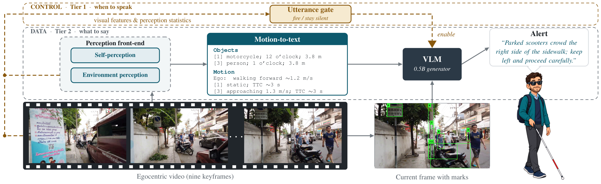
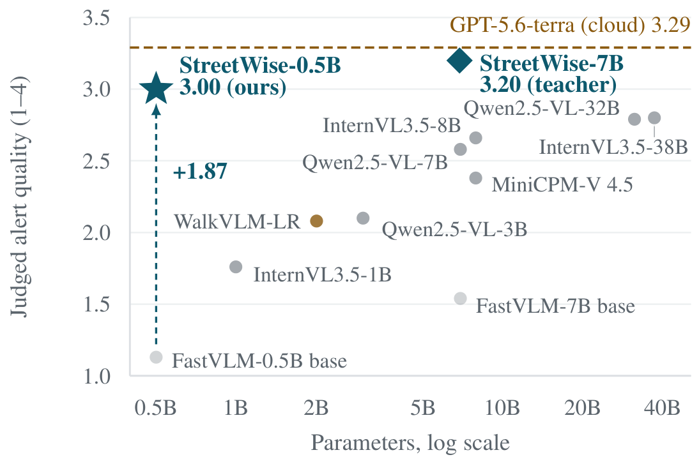
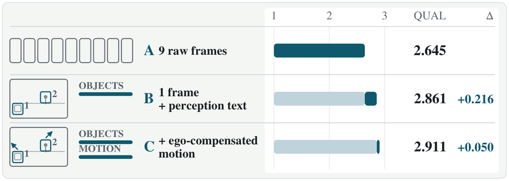
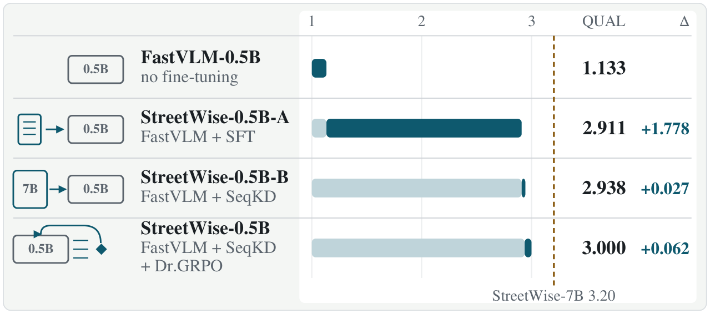
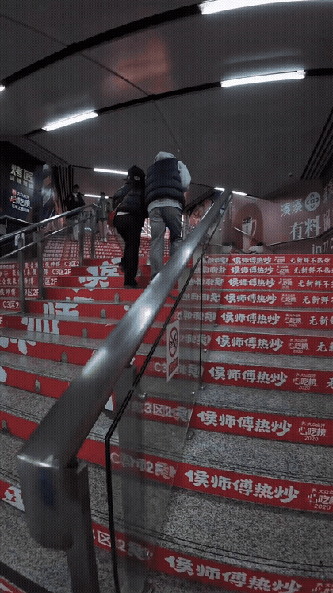
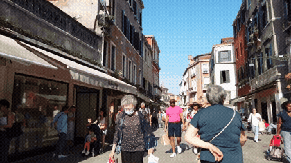

<h2>Knowing What to Say and When: Proactive Hazard Alerts for Visually Impaired Pedestrians with a Lightweight Vision-Language Model</h2>

<em>Anonymous release for double-blind review</em>

<a href="https://anonymous.4open.science/w/streetwise-B7E9/"><b>&#9654; Showcase (videos)</b></a>

---

## Abstract

Advances in vision-language models (VLMs) and smart glasses have made artificial intelligence (AI) walking assistance for blind and low-vision (BLV) people a realistic prospect. The task demands that such an assistant report the hazards confronting a BLV pedestrian both accurately and at low latency. Yet no model at edge-device scale currently sustains this task under the latency and reliability constraints it imposes. We present **StreetWise**, an edge-scale 0.5B VLM system for proactive hazard alerting that attains 91% of the judged quality of the frontier model GPT-5.6-terra and surpasses every open-weight baseline we evaluate, up to 38B. This is achieved by partially relocating environmental perception and temporal reasoning outside the VLM: a motion-to-text module condenses the recent past into a few lines of text, while the VLM observes only the current frame, so that its capacity is devoted entirely to formulating the alert. The generator, a FastVLM-0.5B, is trained by a pipeline comprising supervised fine-tuning of a 7B teacher, sequence-level distillation into the 0.5B student, and reinforcement learning with Dr. GRPO. In support of the system, we recast and relabel 20k clips drawn from several open-source datasets into **StreetWise-20K**, a single annotated corpus produced by a unified automatic labeling pipeline. We also release a small segment of StreetWise-20K as **StreetWise-Bench**, a 300-clip benchmark.

## Architecture

<em>StreetWise architecture.</em>

## Results

<em>Judged quality against parameter count. The 0.5B generator outperforms every open-weight model.</em>

 

<em>Ablation results. <b>Top:</b> Architecture ablation; solid segments show the gains from perception offloading and ego-motion compensation. <b>Bottom:</b> Training ablation; solid segments show the gains from different training stages or fine-tuning strategies. The dashed line denotes the 7B teacher.</em>

## Showcase

<table align="center">
<tr>
<td align="center" width="50%"> <b>StreetWise-0.5B</b> <em>&ldquo;Stairs directly ahead&mdash;stop and use the handrail before climbing.&rdquo;</em></td>
<td align="center" width="50%"> <b>StreetWise-20K</b> <em>&ldquo;Crowded pedestrian street; continue slowly and keep straight behind the person ahead.&rdquo;</em></td>
</tr>
</table>

<a href="https://anonymous.4open.science/w/streetwise-B7E9/">https://anonymous.4open.science/w/streetwise-B7E9/</a>

---

StreetWise-20K, StreetWise-Bench, and the complete system code will be released publicly.
